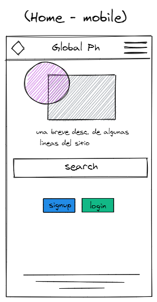
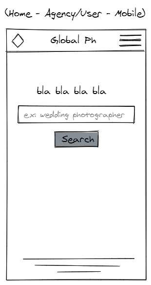
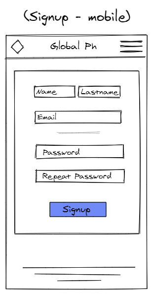
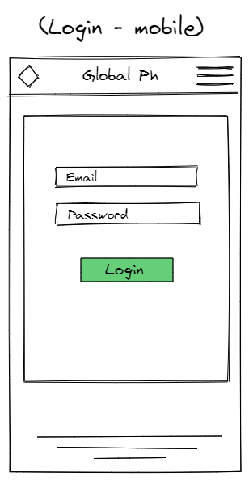
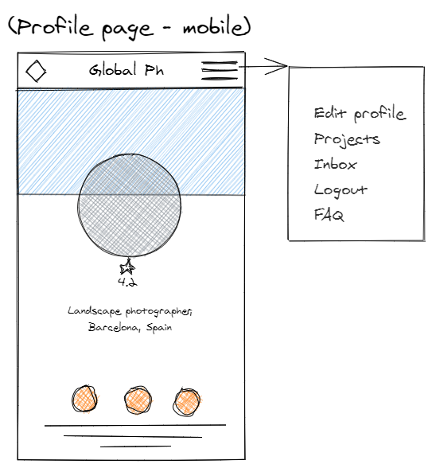
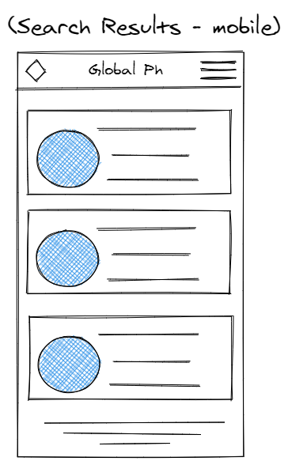

# Global Ph.

## Developer
Santiago Casa

### Links to the App
[Dev]()
[Production]()


## DESCRIPTION

Global Ph its a place were people and agencies will be able to look for photographers all around the world.
Based on geolocation, the user will be able to select the range of distance for the search and the photographer skills to find one that better suit its needs.

## USER STORIES

- **404** - As a user I want to see a nice 404 page when I go to a page that doesn’t exist so that I know it was my fault .
- **500** - As a user I want to see a nice error page when the super team screws it up so that I know that is not my fault.
- **Homepage** - As a user I want to be able to access the homepage so that I see what the app is about and login and signup.
- **Sign up** - As a user I want to sign up on the webpage so that I can sing up.
- **Login** - As a user I want to be able to log in on the webpage so that I can get back to my account.
- **Logout** - As a user I want to be able to log out from the webpage so that I can make sure no one will access my account.
- **User profile page** - As a user I want to see my profile page once I sign up/log in.
- **Search for a photographer** - As a user I want to search photographers around my area based on their location and skills.
- **Photographer portfolio** - As a photographer user I want to be able to create a portfolio to showcase my work to potential clients.


## Backlog
- **Login Social** - Google, Twitter, etc.
- **Chat between artist and client** - Give the possibility to the client to reach out to the artist in a chat.
- **Offer inside the chat** - Give the possibility to the photographer to send an offer to the client, and to the client to accept it via chat.
- **Payments** - Payments between the client and the artist.


## MODELS

### Photographer model
```
- username: String, required
- firstname: String, required
- lastname: String, required
- password: String, required
- profilePicUrl: String
- location: Array String
- projects: Array ObjectId
- portfolio: Array Strings
- skills: Array String
- verified: Boolean
- public: Boolean
- inbox: Array String
```
### Agency/User model
```
- username: String, required
- firstname: String, required
- lastname: String, required
- password: String, required
- profilePicUrl: String
- location: Array String
- inbox: Array String
```
### Project model
```
- artist: ObjectId ref Photographer
- client: ObjectId ref Agency/User
- title: String required
- description: String required
- price: Number
- date: Date required
```
### Offer model
```
- price: Number required
- project: ObjectId ref Project
- artist: ObjectId ref Photographer
- client: ObjectId ref Agency/User
```

## ROUTES
|Method|URL|Description|
|---|---|---|
GET | / | It renders the homepage.

### Auth Routes

|Method|URL|Description|
|---|---|---|
GET | /login | redirects to / if user logged in.
POST | /login | redirects to /profile if the user is logged in
```
body:
    - username
    - password
```

|Method|URL|Description|
|---|---|---|
GET | /signup | Renders the signup form.
POST | /signup | Redirects to /profile after a successful signup
```
body:
    - firstname
    - lastname
    - username
    - email
    - password
    - profilePicUrl (optional)
```
|Method|URL|Description|
|---|---|---|
POST | /logout | Destroys the session and redirects to "/"

### Profile routes
|Method|URL|Description|
|---|---|---|
GET | /profile | renders the user profile. If the user is not logged in will redirect to the homepage. 
GET | /profile/edit/Id | renders user profile edit page. If the user is not logged in will redirect to the homepage. 
POST | /profile/edit/Id | updates user profile. Redirects to /profile
```
body:
    - profilePicUrl
    - firstname
    - lastname
    - username
    - email
    - password
```

### Project routes
|Method|URL|Description|
|---|---|---|
GET | /projects | renders a list of the artist's projects
GET | /projects/Id | renders the page of an specific project
GET | /projects/edit/Id | renders project profile edit page, it is only editable from an Agency/User.
POST | /projects/edit/Id | updates a project. Redirects to /project:Id
POST | /projects/delete/Id | delete a project. Redirects to /profile. Only an Agency/User can delete a project.


### Misc routes
|Method|URL|Description|
|---|---|---|
GET | /portfolio | Renders the Photographer's portfolio
GET | /inbox | Renders the inbox of DMs between photographer and client.


## WIRE FRAMES






